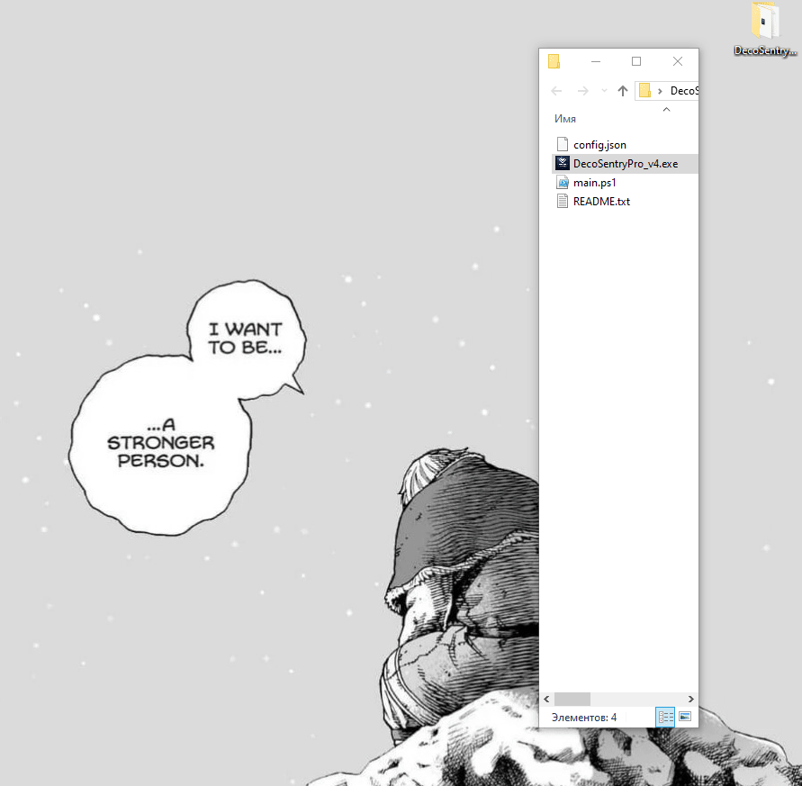

# ᚦ DecoSentryPro v4.0

  
  
  
  
  

---

## ᚠ Описание / Description

**[RU]** **DecoSentryPro** — инструмент автоматизации инфраструктуры для мониторинга Mesh-сетей TP-Link Deco (10+ узлов). Локальное решение на базе **PowerShell 5.1**, заменяющее облачные аналоги.

**[EN]** **DecoSentryPro** is an infrastructure automation tool for monitoring TP-Link Deco mesh networks. A standalone solution built on **PowerShell 5.1** to replace cloud-based monitoring.

> [!IMPORTANT]
> **[RU]** Разработано в рамках системы автоматизации для **ЦССВ №11**.
> **[EN]** Developed as part of the infrastructure automation system for **CSSV #11**.

---

## ᚱ Демонстрация / Demo

  
   
  <i>Интерфейс "Neon" WPF в действии / "Neon" WPF interface in action</i>

---

## ᚼ Ключевые возможности / Key Features

*   **ᛋ Real-time Monitoring:** 
    *   (RU) Многопоточная проверка доступности узлов через .NET.
    *   (EN) Multi-threaded node availability checks via .NET.
*   **ᛗ IaC Approach:** 
    *   (RU) Конфигурация всей сети через один `config.json`.
    *   (EN) Configuration-driven architecture via `config.json`.
*   **ᚲ Custom UI:** 
    *   (RU) Современный "Neon" дашборд (WPF/XAML), написанный в PowerShell ISE.
    *   (EN) Modern "Neon" WPF dashboard developed in PowerShell ISE.
*   **ᛒ Data Export:** 
    *   (RU) Автоматическая генерация CSV-отчетов для аудита.
    *   (EN) Automated CSV generation for inventory and audit compliance.

---

## ᛏ Технический стек / Technical Stack

*   **Logic:** PowerShell 5.1 (Advanced Scripting).
*   **IDE:** PowerShell ISE.
*   **Frontend:** XAML / Windows Presentation Foundation (WPF).
*   **Data:** JSON (Config), CSV (Reporting).

---

## ᛟ Подтвержденная квалификация / Verified Expertise

  
   
  <i>Middle level confirmed in PowerShell / Подтвержденный уровень Middle в PowerShell</i>

---

## ᚦ Структура проекта / Project Structure

*   `main.ps1` — Core application logic / Основная логика.
*   `config.json` — Network topology / Топология сети.
*   `assets/` — Media resources / Медиа ресурсы.
*   `DecoSentryPro_v4.exe` — Standalone binary / Скомпилированный файл.

---

## ᚢ Автор / Author
**MChuvilevM** — System Engineer | Infrastructure Automation specialist.

  <i>"ᛟ Optimized for reliability. Built for scale. ᛟ"</i>

